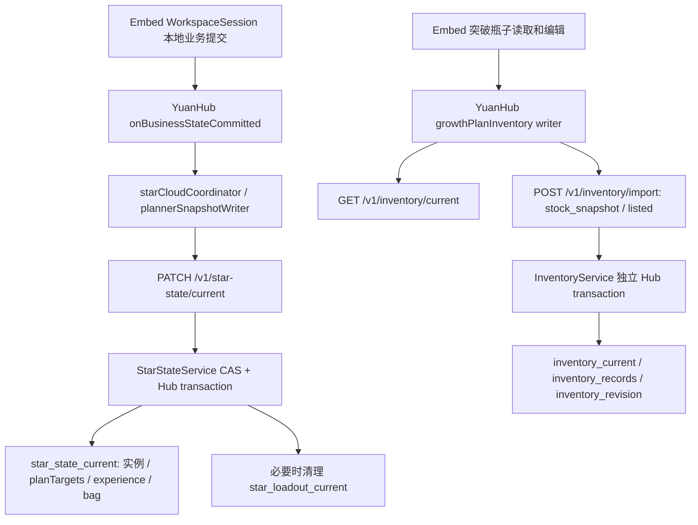

# P2-D 本地收口与 P3 Backend 只读审查

核查日期：2026-10-09。P3 未开发；未向公开 Backend 写入测试数据，未启动本地 Backend。以下 Backend 判断以最新 main `3120bec5186ca07c88a1ca17c750a5b4878830c3` 为准，不以已返回的旧开发分支源码代替 main。

## 本轮成果和本地提交

成功提示「组目标已应用，可撤销」仅在调用处切换为普通信息状态。背景使用现有米白 surface，文字使用现有深棕 text-primary，描边为柔和棕色 `#d8c6bc`。`showToast` 默认仍为 error，每次调用重置状态，后续真实错误不会继承成功配色。没有改变文案、2600ms、圆角、位置、padding 或 Undo/Redo。

桌面及 390px 手机模拟实测：成功背景 `rgb(255,253,246)`、文字 `rgb(73,59,44)`、描边 `rgb(216,198,188)`；真实数量错误仍是红色。成功与错误提示高度均约 37.914px，按钮仍为 32px。沿用既有 coarse-pointer CSS；未做真实触屏设备验收。

保留此前全部 P2-D 成果：组草稿、可编辑预设和自定义档位、已达标抵扣、稳定分配、人工换选、过期保护、一次 WorkspaceSession 应用、同一份 planTargets、路线整理、单次 Undo，以及 P2-C 库存恢复保护。普通组计划替换无需二次确认；仅影响当前大类、名称、品质组。已完成目标和无效路线引用自动清理。

源码本地提交：`42ae3599a8173fd6c5e81bcde3a9c2fc21a68a1b`，`feat(growth): 完善组目标批量编辑与智能分配`。包含 11 个相关源码/测试/审查文件，工作树 clean。YuanHub 本地提交以本报告所属提交为准，标题为 `feat(star): 接入组目标编辑与养成计划收口`。两仓保持 `feat/growth-plan-workspace-p1`，不 push、不合并 main、不 rebase、不 PR。

从该源码提交的 clean 工作树执行 `build:embed`，经 `scripts/sync-yuanstar-embed.mjs` 完整同步 12 个资源；全部字节及 SHA-256 与构建目录一致，manifest 明确记录上述 source commit 和 `{status:"clean"}`。本仓原先没有可调用的同步脚本，因此将既有完整同步流程固化为这一脚本：拒绝 dirty source、HEAD 不符和未经审查的资源集合变化，不删除资源，不手改生成 JS/CSS。

当前入口产物 SHA-256：

| 文件 | SHA-256 |
| --- | --- |
| yuanstar-embed.js | `1d8b60d47ddad9eb504f8918aa149cc1b789e13ee24c229ec6fc496c569fefdc` |
| yuanstar-embed.css | `c2a4accac46899d897447d9637f8b0ac5bd88799a1b00fa54c3242b28b177441` |

## YuanHub 远端及教程兼容

重新 fetch origin/upstream 成功。origin 为 drifty13/YuanHub，upstream 为 MrSnake0208/YuanHub。

| 引用 | 核查结果 |
| --- | --- |
| origin/main | `89ef44116c80584d2010f93bdea53c14a1ce9478` |
| upstream/main | `89ef44116c80584d2010f93bdea53c14a1ce9478` |
| local main | `75b7aa3a8a60c9ab7cb754b1c411530087537b3f`，未更新 |
| 本轮提交前 feature HEAD | `7cec39af300b197a84b93659b22b9ef9d5ca96e3`，相对 origin/main ahead 3 / behind 14 |

fork 已与上游同步（0/0）；local main 落后 14。此次新增一个 host commit 后 feature 相对 origin/main 为 ahead 4 / behind 14；交付时再次核对，不提前解决合并冲突。

上游 `src/config/features.js` 使用 `VITE_TUTORIALS_ENABLED === 'true'` 显式启用，不因 DEV 自动开启。后续合并需人工核对：使用/识别/养成三入口、自动续播、replay、观察器及监听/轮询都遵守开关；关闭时普通帮助和业务可用，开启时保留现有 bag/recognition/plan 三 mode 和下钻教学。上游单教程接线与当前三 mode 接线在 `src/pages/star/index.vue`、`RecognitionTutorial.vue`、教程模块/测试及同步说明存在语义交汇。合并测试须区分默认关闭与显式开启，保留 32px 控件、1:1 布局及现有视觉。此轮没有改开关或合并上游。

## Backend 分支保护与 fast-forward

实际仓库为 BackEndV3-Share；origin 为 drifty13/BackEndV3-Share，upstream 为 MrSnake0208/BackEndV3-Share。重新 fetch 两远端成功。

原工作树 clean，本地 main 是 origin/main 的祖先。main 从 `91e101874055d172584aebc952e674448fdee706` 使用 `git merge --ff-only origin/main` 更新为 `3120bec5186ca07c88a1ca17c750a5b4878830c3`，与 origin/main、upstream/main 相同。之后返回原分支 `fix/star-capture-incremental-upload`，HEAD 仍为 `e20af2f7cfae4dd964b58145030686818ba23179`，工作树 clean；没有修改 Backend 业务源码或合并 main 到该分支。

该开发分支相对它自己的旧远端分支 ahead 13，但全部提交已经可从最新远端 main 到达；`git log --branches --not --remotes` 和 `git branch --no-merged main` 均为空。因此没有远端不可达的本地独有提交。当前开发分支是最新 main 的祖先，main 比它多 12 个提交。上述 ahead 13 不应解释成 13 个尚未发布的独有成果。

## 当前真实调用链

宿主证据：`src/pages/star/index.vue` 的 `onBusinessStateCommitted` 与三个瓶子回调；`src/pages/star/starCloudCoordinator.js` 的 `stateBody`、`committed`；`src/data/plannerSnapshotWriter.js`；`src/pages/star/growthPlanInventory.js`；`src/api/starState.js` 与 `src/api/inventory.js`。

Backend 固定版本证据：

- [StarStateController](https://github.com/drifty13/BackEndV3-Share/blob/3120bec5186ca07c88a1ca17c750a5b4878830c3/src/main/kotlin/com/lhs/share/hub/controller/star/StarStateController.kt) 和 [StarStateService](https://github.com/drifty13/BackEndV3-Share/blob/3120bec5186ca07c88a1ca17c750a5b4878830c3/src/main/kotlin/com/lhs/share/hub/service/star/StarStateService.kt)：JWT userId、账号归属、generation/revision、同一事务内保存并整理 loadout。
- [StarStateRequests](https://github.com/drifty13/BackEndV3-Share/blob/3120bec5186ca07c88a1ca17c750a5b4878830c3/src/main/kotlin/com/lhs/share/hub/controller/star/request/StarStateRequests.kt)：普通 PATCH 是完整星石快照，拒绝未知字段；没有瓶子扣减或 completion idempotency 字段。
- [InventoryService](https://github.com/drifty13/BackEndV3-Share/blob/3120bec5186ca07c88a1ca17c750a5b4878830c3/src/main/kotlin/com/lhs/share/hub/service/inventory/InventoryService.kt)：import 预检、record_id 幂等、snapshot/reward、库存 revision 递增及 consumption_delta 重放。
- [MongoMultiConfig](https://github.com/drifty13/BackEndV3-Share/blob/3120bec5186ca07c88a1ca17c750a5b4878830c3/src/main/kotlin/com/lhs/share/config/mongo/MongoMultiConfig.kt)：上述 Hub repositories 共用 hubMongoTemplate、database factory 和 hubTransactionTemplate。
- [OperatorUpgradeService](https://github.com/drifty13/BackEndV3-Share/blob/3120bec5186ca07c88a1ca17c750a5b4878830c3/src/main/kotlin/com/lhs/share/hub/service/operator/OperatorUpgradeService.kt) 和 [OperatorUpgradeTransaction](https://github.com/drifty13/BackEndV3-Share/blob/3120bec5186ca07c88a1ca17c750a5b4878830c3/src/main/kotlin/com/lhs/share/hub/repository/entity/OperatorUpgradeTransaction.kt)：现有事务内库存扣减、修订检查、唯一幂等键和持久回执的可复用模式。

等级、计划与橙/紫/白经验在同一份 `star_state_current` 文档。路线顺序 `growthRouteOrder` 不在该云端 payload，仍属本地工作区；云状态采用后按有效 planTargets 整理。三种瓶子属于另一份 account/entityType 的 `inventory_current`。当前两个 HTTP 命令各自原子，但不能把两次提交变成一次原子完成；先瓶子后等级、反向顺序或 Promise.all 都有部分成功窗口。

瓶子手动编辑是 listed 的绝对数量观察，零值显式写入，不是 compare-and-deduct。record_id 同 user/account 相同内容重试返回重复，不同内容冲突；不证明星石命令成功，也不约束读取后库存变化。外部 import 仅接受 reward_delta/stock_snapshot，reward_delta 不接受负数，不能冒充消费接口。当前 inventory/current 未暴露 inventory_revision，import 也未接收 expected_revision；timestamp 处理观察先后，不能代替养成扣减的版本基线。

P2-C 的未确认记录精确重试、确认后 GET、可靠基线冲突接纳继续有效；其 pending Map 可跨组件卸载保留，但不等于跨整页刷新持久 completion 回执。星石 CAS writer 的 GET 内容比较能协调普通快照重试，不能证明一次跨资源消费是否整体完成。星石恢复点保存星石/loadout，不恢复瓶子。最新 first-sync 回执只记录连接首次库存导入，不能用作养成完成回执。

服务端已有 JWT 和 user/account 归属过滤。需要特别补齐的前端边界是：瓶子 API 已传 `expectedUserId`，当前 starState API 只有 `auth:true`；共享 request 的身份绑定属于 opt-in，401 后重放可能使用后来登录用户的 token。P3 命令和读取/重试应显式绑定用户，pending 键包含 user/account/generation，不能仅依赖账号名或视图结果忽略。星石普通 PATCH 当前也没有显式 expected_game 参数，P3 必须校验账号 game/gameVersion。

## P3 最小方案：十个问题

| 问题 | 基于当前源码的结论 |
| --- | --- |
| 1. 必须修改 Backend？ | 是。前端组合现有 PATCH 与 import 无法实现要求的五项原子效果。 |
| 2. 最少改哪里？ | 在现有 StarStateController/Service 增加一个完成命令，复用 StarState CAS、库存 repository 和 Hub transaction；增加持久完成回执。可以扩展普通 PATCH，但仍需服务端变更，且会混入普通自动保存，建议独立 action。 |
| 3. 哪些能同事务？ | star_state_current、瓶子 inventory_current、inventory_revision、库存消费记录和完成回执；必要的 loadout 整理仍在同一 Hub transaction。无需新事务框架或跨库 saga。 |
| 4. 当前分属哪些单元？ | 实例/目标/经验是星石文档；瓶子/库存记录是独立库存文档/集合；路线顺序仅本地。当前普通接口没有把它们组合。 |
| 5. 需要版本？ | 需要 expected_generation、expected_star_revision、expected_inventory_revision 和 game；在事务内再次验证，并实际写共享库存修订栅栏，防止与 import/密探升级并发。 |
| 6. 怎样幂等？ | 用户确认时固定 operation_id/Idempotency-Key、不可变请求摘要；持久回执以 user/account/key 唯一。相同 key/body 返回原结果，不同 body 409。先查已提交回执，再检查旧基线。 |
| 7. 断网怎样恢复？ | 持久保存原命令与 key，未知结果时重复同一 POST 获取原回执；不能换新 key 或直接再次扣减。额外 GET receipt 可选，不是正确重试的必要条件。 |
| 8. 防止瓶子扣了等级没变？ | 所有效果和回执在一事务提交；失败全部回滚，不靠前端多次写入或事后补偿。 |
| 9. 需要完成回执？ | 需要持久 operation 回执。inventory record_id 只能证明单条导入，已有密探升级回执不对应 starInstanceId。可复用其模式，不能直接调用密探升级接口。 |
| 10. 前后端职责？ | 前端采集实际消耗、临时节点选择、绑定身份、忙状态、持久重试及采用结果；Backend 校验归属/版本/实例/材料、原子扣减、幂等和回执。后端是成功事实的权威。 |

建议 action 名称如 `POST /v1/star-state/completions?account_id=...`，仅为设计示例，当前不存在，本轮未实现。无需为方案先新增一套独立基础设施。

一致读取可最小扩展现有 star current GET：可选 `include=growth_inventory` 在同一个只读事务返回星石状态、三瓶子、inventory_revision 和 game。也可小型 preview 返回绑定基线。分开 GET 再在命令内严检双 revision 能拒绝过期，但不应宣称它们天然是同一时刻读到的快照。

完成命令携带唯一选中实例及 from/to、目标、三色实际经验数量、三瓶实际数量、临时起点/终点突破节点、双 revision/generation/game。在一事务中确认当前等级与计划匹配、实例不重复、归属正确、合法等级和非负整数、库存足够；仅更新选中实例、清理完成计划并扣指定资源，保留其他数据。共享 inventory_revision 必须参与实际写冲突/CAS，不能只读比较。

经验继续按橙 1000、紫 500、白 100，橙→紫→白只用于默认建议，最终扣用户确认的实际数量。经验条未知时，实际消耗可能小于保守路线估算，不能强制实际数量至少等于估算。10/20/30/40/50 突破表复用已确认规则；起点和终点整十级修正仅此次确认有效，不持久化突破状态，不根据瓶子颜色猜规则。

回执至少保存操作身份、请求摘要、实例等级变化、实际扣量与结果余额、generation/game、两类结果 revision、提交时间。并发唯一键冲突后查同摘要的已提交回执。未知提交状态禁止“先退款”或生成新 key；明确失败后重新读取并由用户重新确认。返回旧回执时若本地已采用更新版本，不覆盖更新状态，应读最新。

前端先采用服务器成功结果，再整理本地路线，并协调普通 CAS writer，避免回执采用被误当作下一次全量自动保存；不能先乐观写本地等级当成成功。锁定双击/未完成写入，显式绑定 expectedUserId，避免切账号串写；服务端幂等仍需抵御多标签页和网络重试。普通本地 Undo 不等于真实库存退款，P3 需单独明确撤销政策，本轮不实现扣减或回滚。

现有 OperatorUpgradeService 的 preview/execute 已示范同事务扣量、库存版本、幂等回执和 consumption_delta；它处理 operator_current，不能直接替 starInstanceId 服务。P3 消费记录还需纳入库存历史重放、删除保护与后续 snapshot 的边界测试；现有禁止删除消费记录的文案和约束以密探升级为对象，复用时需窄范围扩展。

## 实际验证和边界

| 已执行 | 结果 |
| --- | --- |
| source：`npm --prefix web run typecheck` | 通过 |
| source：`npm --prefix web run test:growth-group` | 37/37，A–G 分配、已达标抵扣、稳定排序、手动换选、批量应用/Undo及隔离 |
| source：`npm --prefix web run test:growth-plan` | 规则、资源需求和显示专项通过 |
| source：`npm --prefix web run test:product-data-transfer` | JSON/实例身份/路线及组计划专项通过 |
| source：`npm --prefix web run build:embed` | 已提交 clean source 构建通过，OCR 资产检查通过 |
| host：`npm run test:behavior -- behavior/growthPlanEmbed.spec.js behavior/growthPlanInventoryApi.spec.js behavior/growthPlanInventoryIdentity.spec.js` | 54/54，真实生成 bundle 配 mock/fixture；成功状态和随后错误红色回归、单次 Undo |
| host：`node --test test/growthPlanInventory.test.js` | 26/26，精确幂等重试、确认后 GET、冲突恢复和身份边界 |
| host：`node --test test/yuanstarEmbedProvenance.test.js` | 6/6，source commit、clean manifest、完整 12 文件 SHA-256 |
| host：同步脚本语法与执行 | 语法通过；dirty source 正确拒绝；clean source 正常完整同步并核验字节 |
| host：`npm run build` | 通过，OCR/gzip 资源检查通过；既有动态导入/chunk 提示非阻断 |
| Git diff check | 两仓通过 |

隔离 fixture 的桌面及 390×844 手机模拟完成实际编辑、预览、确认、错误输入与 Undo；不接真实云保存回调。截图保留于忽略目录 `.ux/audits/p2d-closeout/`，不入 Git：`success-toast.jpg`、`error-toast.jpg`、`mobile-success-toast.jpg`。此前专项分配截图见 [分配审查](./growth-plan-p2d-allocation-review.md)。预览仍为 <http://127.0.0.1:5175/star>，宿主代理仍为公开 Backend `https://api-hub.maayuan.com`。

未执行无关全量测试、真实设备测试、公开后端扣减、Backend 构建/运行、Mongo 部署事务验证或 P3 集成实验。P3 后续必须在隔离数据库验证：事务各步骤异常全部回滚、断网已提交/未提交、并发重复 key、不同 body 冲突、双修订过期、导入/密探升级竞争、切用户/账号/generation/game、历史重放及刷新恢复。这些是未来实施的必要验证，不能算作本轮已通过。

本轮到本地提交与只读审查为止，停止等待人工验收。
